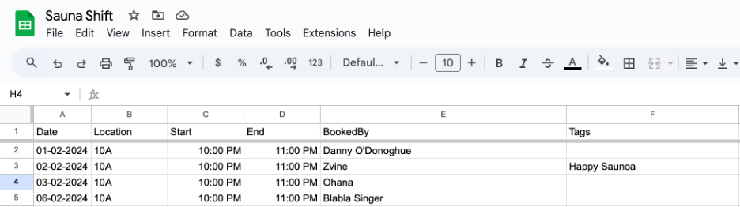
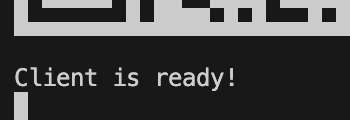

# Sauna-bot

This was created for our scheduling of sauna turn at our Student dormitory. Our Dorm's Sauna is really spacious to be used for just individually, so I come up with an idea of sharing it together since we are an international student. But previously we all keep forgetting when is the next suana for us? and who booked it? we want to avoid crashing book slot and also some fun joke for us.

> Example Data Log

I used [Google App Script](https://script.google.com/) to extract data from Google Sheet. Yes, to keep it simple and ultilized free software I choose this one.

Take a look at how I write Script in Google Script in file `appScript.gs`, then after deploy you will get the script url to place in your `.env` like the example in `.env.example`

I used EC2 on AWS free tier to host my bot. You can freely checkout [Netlify](https://www.netlify.com/) or [Vercel](https://vercel.com/) or other easy free hosting service. (But keep in mind, I didn't wrote this script for an easy deployment. It was just an easy attempt for me).

## How to Start the script?

simply run:

> npm install `OR` yarn install

Then run:

> npm start `OR` yarn start

The console log will show QR Code for you to login with your WhatsApp.

Note: You are required a WhatsApp number to act as a bot itself. (I used my unused number for this). Once the console show `Client is ready` you can start using the bot command.

Done! Try simple text in WhatsApp like: `help` to see all commands.
